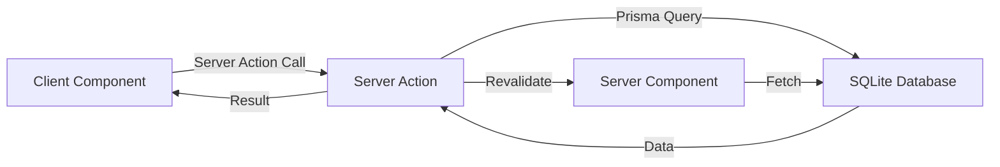
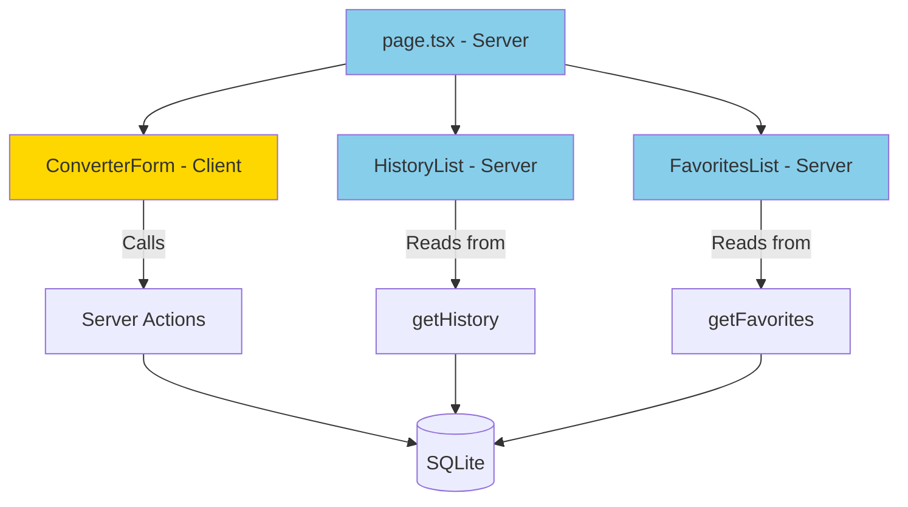
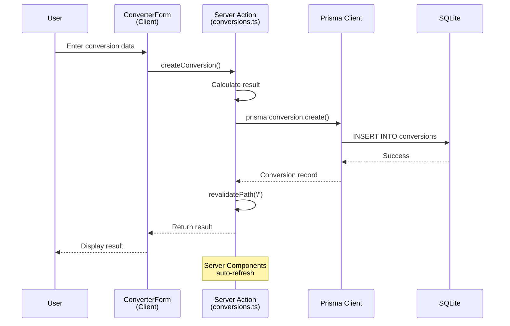
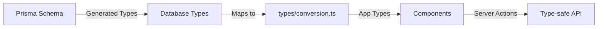
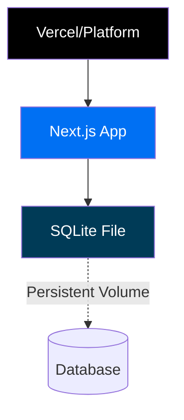

# Unit Converter - Architecture Document

## System Overview

This application uses **Next.js 14 App Router** with a clear separation between Server and Client Components. The architecture follows a modern React Server Components pattern where:

- **Server Components** handle data fetching (history, favorites)
- **Client Components** manage interactive UI (form inputs)
- **Server Actions** process conversions and database operations
- **Prisma ORM** provides type-safe database access to SQLite

### Data Flow



---

## Folder Structure

```
app/
├── actions/
│   └── conversions.ts      # Server Actions ('use server')
├── components/
│   ├── converter-form.tsx  # Client Component (interactive form)
│   ├── history-list.tsx    # Server Component (data display)
│   └── favorites-list.tsx  # Server Component (data display)
├── lib/
│   ├── prisma.ts          # Prisma client singleton
│   ├── conversions.ts     # Pure conversion logic
│   └── utils.ts           # Utility functions (shadcn)
├── types/
│   └── conversion.ts      # TypeScript type definitions
└── page.tsx               # Main page (Server Component)

prisma/
├── schema.prisma          # Database schema
└── migrations/            # Auto-generated migrations
```

---

## Component Hierarchy



**Legend:**
- 🟦 Blue = Server Component
- 🟨 Yellow = Client Component

---

## Data Flow Architecture

### Request Flow



### Component Interaction

1. **User Input** → `ConverterForm` (Client Component)
2. **Form Submit** → `createConversion()` Server Action
3. **Calculate** → Pure conversion logic (`lib/conversions.ts`)
4. **Persist** → Prisma → SQLite database
5. **Revalidate** → Triggers Server Component refresh
6. **Display** → `HistoryList` / `FavoritesList` auto-update

---

## Tech Stack Decisions

### Why Next.js App Router?

- **Server Components by default** → Reduced client bundle size
- **Built-in Server Actions** → No API routes needed
- **Automatic code splitting** → Faster page loads
- **Type-safe data fetching** → TypeScript end-to-end

### Why Server Actions?

✅ **Advantages:**
- Direct server-side execution (no API layer)
- Automatic request deduplication
- Built-in revalidation (`revalidatePath`)
- Progressive enhancement ready
- Type-safe by default

❌ **Alternative (API Routes):**
- More boilerplate code
- Separate endpoint management
- Manual revalidation logic

### Why SQLite?

✅ **Perfect for this use case:**
- Zero-config database (no separate server)
- File-based (easy deployment)
- Fast for small-to-medium datasets
- Built-in with Prisma
- Local development simplicity

**When to upgrade:**
- Multi-user at scale → PostgreSQL/MySQL
- Real-time sync → Firebase/Supabase
- Complex queries → Full SQL database

### Server vs Client Components

| Component | Type | Reason |
|-----------|------|--------|
| `page.tsx` | Server | Static layout, composition |
| `ConverterForm` | Client | Interactive form state |
| `HistoryList` | Server | Database read (no interaction) |
| `FavoritesList` | Server | Database read (no interaction) |

**Rule of thumb:**
- Default to **Server Component**
- Use **Client Component** only for:
  - `useState`, `useEffect`, event handlers
  - Browser APIs (localStorage, window)
  - Third-party interactive libraries

---

## Key Design Patterns

### 1. Singleton Pattern (Prisma Client)

**Problem:** Multiple Prisma instances cause connection issues in dev

**Solution:**
```typescript
// lib/prisma.ts
const globalForPrisma = global as unknown as { prisma: PrismaClient }

export const prisma = globalForPrisma.prisma || new PrismaClient()

if (process.env.NODE_ENV !== 'production')
  globalForPrisma.prisma = prisma
```

### 2. Server Actions Pattern

**Structure:**
```typescript
'use server' // Mark entire file as server-only

export async function createConversion(input: ConversionInput) {
  // 1. Validate input
  // 2. Calculate conversion
  // 3. Save to database
  // 4. Revalidate path
  // 5. Return result
}
```

**Benefits:**
- Collocate logic with components
- Type-safe client/server boundary
- Automatic serialization

### 3. Pure Functions (Conversion Logic)

**Separation of concerns:**
```typescript
// lib/conversions.ts (Pure functions)
export function convertLength(value: number, from: string, to: string): number {
  // No side effects
  // No database calls
  // Easily testable
}

// app/actions/conversions.ts (Side effects)
export async function createConversion() {
  const result = convertLength(...) // Use pure function
  await prisma.conversion.create(...)  // Side effect
}
```

### 4. Component Composition

**Page as Orchestrator:**
```typescript
// app/page.tsx
export default function Home() {
  return (
    <>
      <ConverterForm />       {/* Interactive */}
      <HistoryList />         {/* Server-rendered */}
      <FavoritesList />       {/* Server-rendered */}
    </>
  )
}
```

Each component has a single responsibility.

### 5. Type Safety Layer



**Flow:**
1. Define schema in `schema.prisma`
2. Generate Prisma types (`@prisma/client`)
3. Create app-specific types (`types/conversion.ts`)
4. Use throughout components (full IntelliSense)

---

## Critical Implementation Rules

### Component Marking

```typescript
// Server Component (default - no marking needed)
export default async function HistoryList() { ... }

// Client Component (explicit marking required)
'use client'
export default function ConverterForm() { ... }

// Server Action (explicit marking required)
'use server'
export async function createConversion() { ... }
```

### Data Fetching Boundaries

❌ **NEVER:**
```typescript
'use client'
import { prisma } from '@/lib/prisma' // Exposes DB to client!
```

✅ **ALWAYS:**
```typescript
// Server Component or Server Action only
import { prisma } from '@/lib/prisma'
```

### Revalidation Pattern

```typescript
'use server'
import { revalidatePath } from 'next/cache'

export async function createConversion() {
  await prisma.conversion.create(...)
  revalidatePath('/') // ← Triggers Server Component refresh
}
```

---

## Performance Considerations

### Bundle Size

- **Server Components:** Zero JavaScript to client
- **Client Components:** Only `ConverterForm` sends JS
- **Estimated bundle:** ~50KB (React + shadcn components)

### Database Queries

- History: `LIMIT 10` (prevents large data transfer)
- Favorites: Filter at DB level (`WHERE isFavorite = true`)
- No N+1 queries (single queries per component)

### Caching Strategy

- **Static:** Page layout (cached by default)
- **Dynamic:** Conversion results (revalidated on action)
- **No caching:** Form state (client-side only)

---

## Deployment Architecture



**SQLite Persistence:**
- Development: Local `prisma/dev.db`
- Production: Persistent volume or upgrade to PostgreSQL

**Environment Variables:**
```env
DATABASE_URL="file:./dev.db"  # Dev
DATABASE_URL="postgres://..."  # Prod (if scaling)
```

---

## Error Handling Strategy

```typescript
// Server Action
export async function createConversion() {
  try {
    const result = await prisma.conversion.create(...)
    revalidatePath('/')
    return { success: true, data: result }
  } catch (error) {
    console.error('Conversion failed:', error)
    return { success: false, error: 'Failed to save conversion' }
  }
}

// Client Component
const result = await createConversion(...)
if (!result.success) {
  toast.error(result.error) // User feedback
}
```

**Validation layers:**
1. Client-side: Input type checking
2. Server Action: Business logic validation
3. Prisma: Schema constraints
4. Database: SQLite constraints

---

## Summary

This architecture provides:

✅ **Type Safety:** TypeScript + Prisma end-to-end
✅ **Performance:** Server Components + minimal client JS
✅ **Simplicity:** Server Actions (no API layer)
✅ **Maintainability:** Clear separation of concerns
✅ **Scalability:** Easy migration path to PostgreSQL

**Core Philosophy:** Server-first with client interactivity only where needed.
